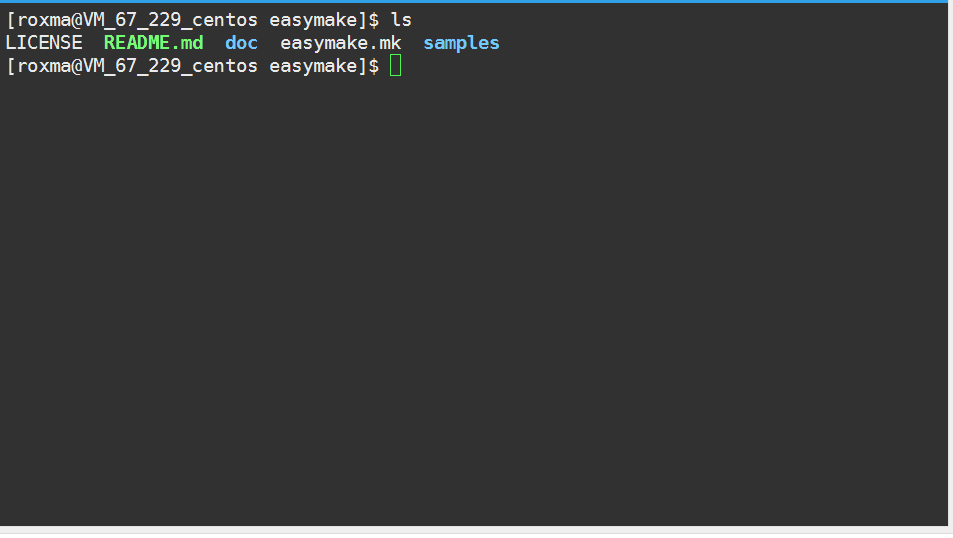
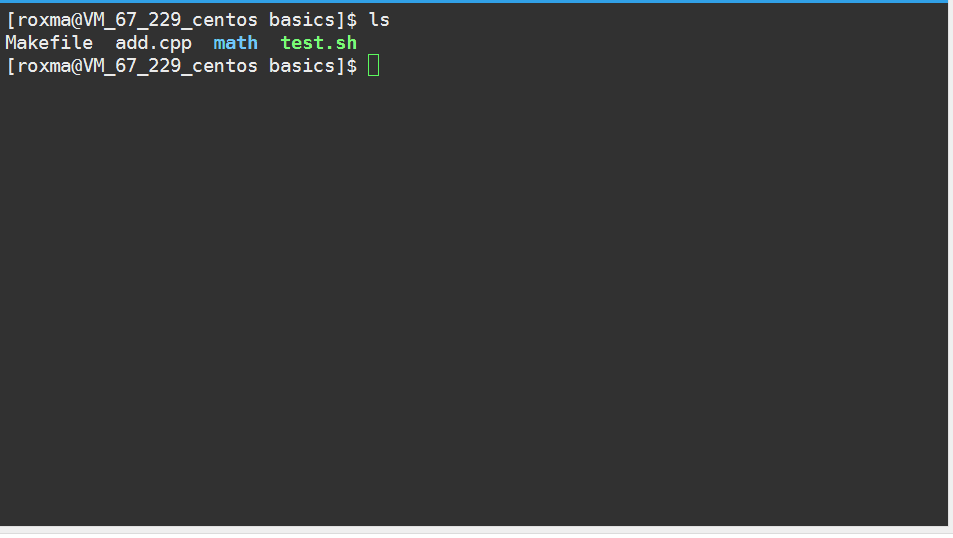
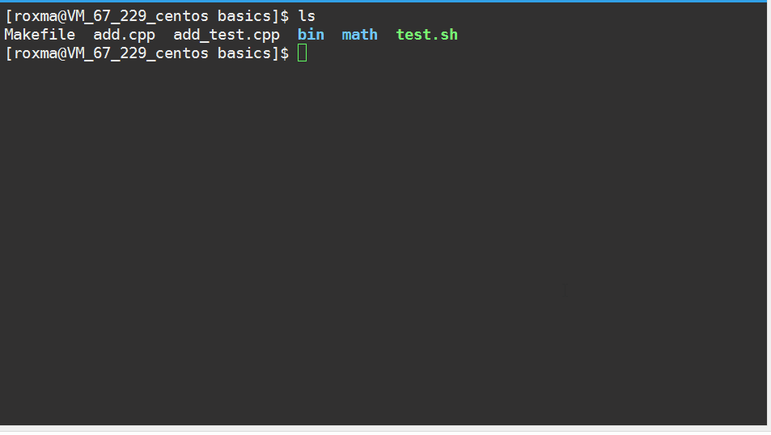

# Getting Started with Easymake #


  
## Introduction ##

Easymake is a generic makefile for C/C++ on linux system. For simple C/C++ applications, you don&rsquo;t even need to write a single line of makefile code to build your target with easymake.

Features description:

* Finds and compiles all C/C++ source files in the directory recursively (optional). Places the object files and target files in a separate directory.
* Only re-compiles the changed and affected source files.
* Supports Simple unit testing.
* Handles more than one entry point in the project.

## Getting Started ##

### Basics

```
git clone https://github.com/roxma/easymake
cd easymake/samples/basics
cp ../../easymake.mk Makefile
make
./bin/add  # if you rename add.cpp to myprogram.cpp, then you get ./bin/myprogram.cpp
```



### Unit Testing

Files with `*_test.cpp` or `*_test.c` pattern will be used for testing (inspired by golang).



### Multi Entries

Why bother writing a Makefile?



### Options

Easymake is trying to use the [Standard Makefile Conventions](https://www.gnu.org/prep/standards/html_node/Makefile-Conventions.html). The following options are supported.

- `CFLAGS` Extra flags to give to the C compiler.
- `CXXFLAGS` Extra flags to give to the C++ compiler.
- `LDFLAGS` Extra flags to give to compilers when they are supposed to invoke the linker
- `LDLIBS` Library flags or names given to compilers when they are supposed to invoke the linker
- `ARFLAGS` Flags to give the archive-maintaining program; default `cr`

